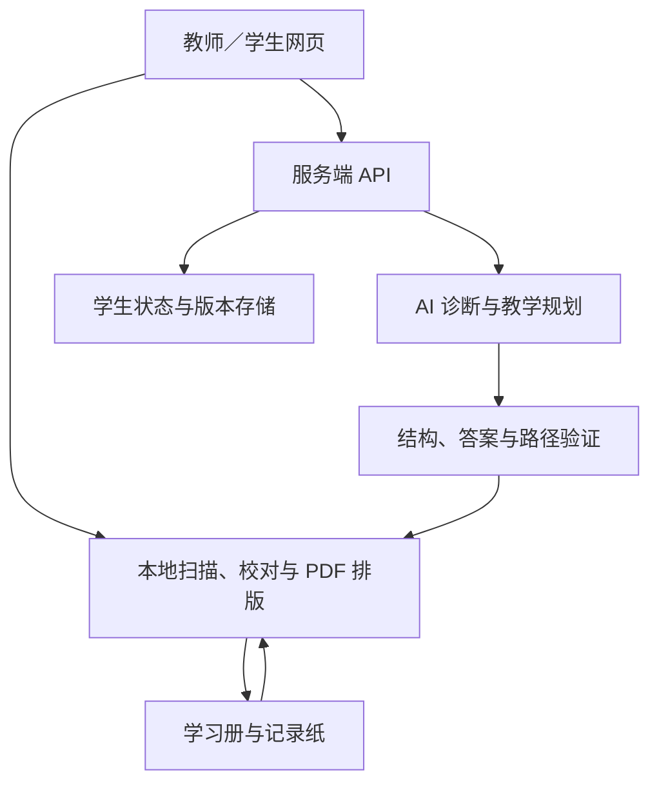

# PAPER AI 程序框架

> 设计版本：2026-09-26。本文是待实现方案，不表示已有可运行程序或实验结果。内部设计使用中文；正式参赛内容与展示版本使用英文。

## 1. 目标与首版边界

系统把一段时间的教学策略编译为纸质学习包，由学生离线执行，再用独立记录纸把学习证据带回系统。核心研究对象是“纸上执行的教学策略＋下一轮更新”，不是只生成题目。

首版采用一个网页应用，提供教师入口和可选学生入口。学生不必拥有设备；教师可用共享电脑生成材料、手机扫描、打印机输出。首版建议选择一元一次方程的移项单元，最终学科和赛道仍待团队决定。

| 首版实现 | 后续扩展 |
|---|---|
| 教师建档、短诊断、单知识单元 | 跨学科知识图谱、学校管理系统 |
| 选择题分支、分层提示、补救练习 | 卡片、排序、折叠等活动 |
| 固定记录模板、选框识别、人工校对 | 长篇手写过程理解 |
| 真实 AI 规划与诊断、结构化输出 | 更复杂的学生模型或模型训练 |
| 两轮学习包、PDF、版本追踪 | 多周干预与接入频率优化 |

## 2. 系统边界与部署

| 位置 | 职责 | 联网条件 |
|---|---|---|
| 浏览器本地 | 表单、图像校正、固定选框识别、校对、预览和 PDF 渲染 | 页面、识别资源、字体和学习包已缓存后，相关操作可离线；离线能力需实际验证 |
| 服务端 | 身份与数据权限、任务队列、AI 调用、版本保存、方案验证 | 调用远程 AI 和跨设备同步时需要网络 |
| AI 服务 | 依据证据提出误区诊断、学习顺序、分支和解释 | 首版按在线调用设计，不能宣传为完全离线 AI |
| 纸张 | 执行预设分支、按需查看提示、记录学习证据 | 学习期间无需网络与学生设备 |

API 密钥只保存在服务端。浏览器直接排版已验证的 JSON；服务器无需代替浏览器生成 PDF。首版可在教师电脑运行应用服务，手机通过同一局域网接入；如改为托管部署，应另行确认权限与保存策略。这里只定义架构，不锁定尚未评估的第三方库。

## 3. 模块与建议代码职责

| 建议模块 | 输入与输出 | 必须负责的事情 |
|---|---|---|
| `profiles` | 表单 → StudentProfile / TeachingConfig | 必填校验、匿名编号、需求录入 |
| `capture` | 图片 → ScanDraft | 定位、去透视、选框读取、保留不确定值 |
| `review` | ScanDraft → ConfirmedTrace | 原图对照、异常提示、人工确认与修正日志 |
| `assessment` | ConfirmedTrace＋原包答案 → Evaluation | 确定性评分、区分首次／提示后／重试 |
| `student-model` | 历史证据 → StudentState | 掌握状态、疑似误区、证据引用、版本 |
| `ai-gateway` | AIRequest → AIProposal | 提示词与模型版本、请求记录、超时与有限重试 |
| `planner-validator` | AIProposal → validated / rejected | 字段、答案、路径、范围和资源约束验证 |
| `paper-compiler` | 教学图 → CompiledPackage | 布局、任务定位、页码映射、记录模板映射 |
| `pdf-renderer` | CompiledPackage → 三类 PDF | 学生册、记录纸、教师版；打印预览 |
| `rounds` | 轮次与版本 → 状态流转 | 防重复提交、冻结已发包版本、生成下一轮 |
| `evaluation` | 脱敏记录 → 研究汇总 | 技术指标、学习指标、真实／模拟数据分离 |

建议项目层次为 `client/`、`server/`、`shared/contracts/`、`templates/`、`examples/`、`tests/`。这些目录目前只是规划，不能作为程序已实现的证据。

## 4. AI、规则和教师如何分工

AI 获得经确认的学习证据、题目上下文、学生历史与教学约束，给出教学建议和结构化教学图。程序做确定性计算、结构检查和排版。教师审核教育适切性和无法自动核验的内容。

首版优先让 AI 从审核过的题库选择题目，并生成有针对性的解释与路径；新生成题目也必须过答案核验。诊断结果引用具体任务证据，使用“待验证／有支持证据”等状态，不能把一次错误解释为确定的长期能力标签。若没有训练自己的模型，应如实描述为模型 API、提示词设计与系统集成。

AI 请求包含：目标、已确认记录、原题与答案、学生状态、可选内容、页数与语言限制、输出协议。AI 响应不允许包含可执行脚本或任意 HTML；数学文本和排版指令使用受限字段。

## 5. 教学编译器

编译流程：字段与引用校验 → 内容审核 → 图路径检查 → 版面测量 → 分页 → 回填跳转页码 → 生成记录纸 → 输出 PDF。

首版教学图采用有向无环结构，重复练习使用不同节点。每个可达节点必须能到达结束；选择题选项各有去向，并提供“不确定”的可执行路径。学生根据实际选项跳转，纸张不自动识别任意手写答案。开放题可用于下一轮诊断；若要当场分支，必须设计明确的自查区和有限跳转条件。

页码由编译器生成，AI 只给稳定任务编号。提示区可用独立提示页或折叠遮盖，记录纸填写最高提示级别；系统只能记录学生报告的使用情况，不声称能监测其是否偷看。版面超限时返回重新规划，不自动缩小到不可读字体。

学生包、记录纸和教师版分开生成。学生端 API 不返回教师答案字段；教师端完整数据可用于生成三种 PDF。若学生自助打印，使用已脱敏的学生打印数据，不能把完整答案 JSON 隐藏在界面里当作隔离。

## 6. 存储、故障与恢复

| 对象／情况 | 处理方式 |
|---|---|
| 已发行学习包 | 编号、版本、内容哈希、打印模板均冻结；修改建立新版本 |
| 重复扫描 | 原图可留多个扫描尝试，同一记录提交使用幂等键；重复确认不重复累计成绩 |
| 缺页／错版本 | 阻止自动合并，提示补扫或选择正确包 |
| 低置信度／多选 | 保留 unknown 并交教师确认，AI 不替学生猜答案 |
| 不符合路径 | 显示“实际访问与计划不一致”，允许保留真实访问，不能修改成理想路径 |
| AI 返回错误 | 带具体错误有限次修正；仍失败则保留草稿并让教师处理 |
| AI 不可用 | 继续已打印的学习任务；展示可用历史包。回放结果标明缓存，不能冒充实时 AI |
| 本地未同步 | 队列保留待同步状态，明确何时已保存／已上传 |

学生身份映射与学习内容分离。上传 AI 默认使用匿名编号和必要结构化证据；上传原图、真实学生研究数据须先按学校流程取得相应同意。原图保留期限、删除和备份策略在测试前由团队与学校明确。

## 7. 首版验收

两名表现不同的示例学生得到不同路径；一名学生完成至少两轮；每次变化可追溯到记录证据；纸上路径实际可执行；纸张实印后能扫描；真实 AI 调用可审计；扫描错误能被校对；所有参赛演示界面与输出可切为英文。具体测试见 [研究与验证计划](research_plan.md)。
